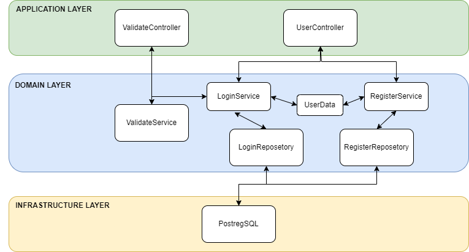

---

<table>
    <thead>
        <tr>
            <td><h5>Funkcionalne</h5></td>
            <td><h5>Nefunkcionalne</h5></td>
        </tr>
    </thead>
    <tbody>
        <tr>
            <td>Prijava uporabnikov in generiranje JWT</td>
            <td>Ob vsaki prijavi se mora za uporabnika zgenerirati JWT token na novo, proces nesme trajati dlje kot 2 sekundi</td>
        </tr>
        <tr>
            <td>Registracija uporabnika v sistem</td>
            <td>Podatki morejo biti preverjeni da niso prazni in geslo se mora shraniti sifrirano</td>
        </tr>
        <tr>
            <td>Avtentikacija uporabniskih JWT</td>
            <td>Stvar je treba izvesti in na request odgovoriti v majn kot sekundi</td>
        </tr>
    </tbody>
</table>