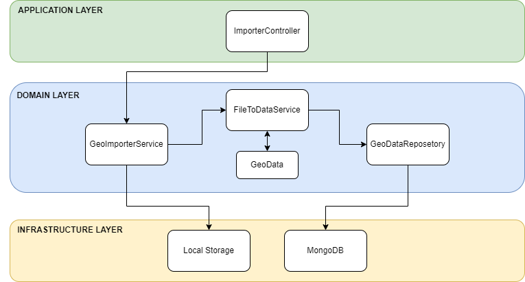

---

<table>
    <thead>
        <tr>
            <td><h5>Funkcionalne</h5></td>
            <td><h5>Nefunkcionalne</h5></td>
        </tr>
    </thead>
    <tbody>
        <tr>
            <td>Shranjevanje podatkov na disk</td>
            <td>Shranjevanje ne sme trajati vec kot 4 sekunde</td>
        </tr>
        <tr>
            <td>Shranjevanje geometrije in atributov geometrije v podatkovno bazo</td>
            <td>Podatke se iz datoteke pretvori in shrani v podatkovno bazo v majn kot 2 sekundah</td>
        </tr>
        <tr>
            <td>Uporabnika se obvesti da je bil vnos uspesen in se posodobi grafika</td>
            <td>Uporabnika se obvesti in prikaze grafiko v majn kot 2 sekundah</td>
        </tr>
    </tbody>
</table>