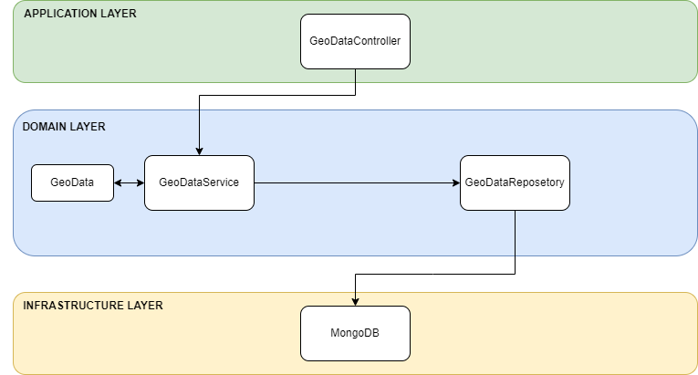

---

<table>
    <thead>
        <tr>
            <td><h5>Funkcionalne</h5></td>
            <td><h5>Nefunkcionalne</h5></td>
        </tr>
    </thead>
    <tbody>
        <tr>
            <td>Pridobivanje dolocene geometrije za prikaz</td>
            <td>Geometrijo aplikacija najde in prikaze v majn kot 1 sekundi</td>
        </tr>
        <tr>
            <td>Pridobivanje vseh geometrij ki so v bazi</td>
            <td>Geometrije aplikacija pobere skupaj in prenese ter prikaze v majn kot 5 sekundah</td>
        </tr>
        <tr>
            <td>Oridobivanje atributov za doloceno geometrijo</td>
            <td>Atribute za geometrijo aplikacija najde in prikaze v majn kot 1 sekundi</td>
        </tr>
    </tbody>
</table>